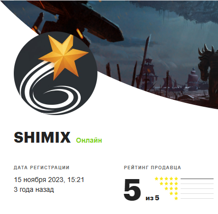

<table>
  <tr>
    <td width="200" align="left">
      
    </td>
    <td align="center">
      <h1>CODE 5 BOTS</h1>
      

        <b>Набор ботов-помощников для GTA&nbsp;5&nbsp;RP</b> 
        Автоматизация рутинных занятий: шахта, стройка, порт, качалка, готовка, фермы и другое.
      

      

        
        
        
        
      

      

        <a href="https://funpay.com/users/8967024/"><b>🛒 Купить на FunPay</b></a>
        &nbsp;·&nbsp;
        <a href="https://github.com/code5-ux/code5bots-downloads/releases/latest"><b>⬇️ Скачать последнюю версию</b></a>
        &nbsp;·&nbsp;
        <a href="https://www.youtube.com/@Beber-j6e"><b>▶️ YouTube</b></a>
      

    </td>
  </tr>
</table>

---

## О софте

**CODE 5 BOTS** — это десктопное приложение для Windows, которое автоматизирует однообразные занятия в GTA 5 RP. Один клик - и бот помогает вам выполнять выбранное действие: кликает, качается в зале, готовит и т.д. Управление всеми ботами собрано в одном удобном окне.

Приложение распространяется **по лицензии** и привязывается к вашему устройству. Обновления приходят **автоматически** — новые версии выкладываются в этот репозиторий, а программа сама устанавливает их при запуске.

> Этот репозиторий — **официальный канал загрузок и обновлений**. Здесь всегда лежит актуальная сборка. Купить доступ можно на [FunPay](https://funpay.com/users/8967024/).

---

## Поддерживаемые проекты

| Проект       | Статус             |
|--------------|--------------------|
| **GTA5RP**   | ✅ Доступно         |
| **Majestic** | 🛠 В разработке     |

---

## Боты в комплекте

| Бот              | Что делает                                              |
|------------------|---------------------------------------------------------|
| 💤 **AFK-система** | "Колесо удачи", "Лотерея", "Анти-АФК", "Авто-реконнект" |
| 🔒 **Деморган**    | Настройка скорости, таймера, имитация движений          |
| 📱 **Вызовы КПК**  | Автопоимка заказов                                      |
| ⛏ **Шахта**       | Автоматический клик по нужной клавише + автобег         |
| 💪 **Качалка**     | Самостоятельная прокачка в спортзале + автоеда          |
| 🏗 **Стройка**     | Автоматический клик по нужной клавише + автобег         |
| 🚢 **Порт**        | Автоматическое прохождение мини-игры + автобег          |
| 🐄 **Коровы**      | Автоматическое прохождение мини-игры + автобег + автонажатие на E |
| 🍳 **Готовка**     | Приготовление блюд + работа в фоне                      |

---

## Возможности

- 🖥 **Единое окно управления** — все боты и настройки в одном месте.
- 🔄 **Автообновления** — программа сама проверяет и ставит новые версии.
- 🧠 **Имитация человека** — «человеческие» движения мыши и задержки в ключевых ботах.
- ⌨️ **Горячие клавиши** — быстрый старт/стоп без переключения на приложение.
- 🎯 **Гибкие настройки** — лимиты, паузы и параметры под свой стиль игры.
- 🏆 **Трекер Боевого пропуска** — отслеживание заданий BP.
- 🔊 **Звуковые оповещения** — сигналы о событиях и завершении работы.
- 🌗 **Тёмная/светлая тема** — оформление на выбор.
- 🔐 **Лицензионная защита** — доступ по ключу с привязкой к устройству.

---

## Установка и активация

1. Купите доступ на **[FunPay — SHIMIX](https://funpay.com/users/8967024/)** и получите лицензионный ключ.
2. Скачайте `CODE5BOTS.exe` со страницы **[Releases](https://github.com/code5-ux/code5bots-downloads/releases/latest)**.
3. Запустите файл (установка не требуется - это готовая программа).
4. В окне активации введите полученный ключ в формате **`XXXX-XXXX-XXXX-XXXX`** (можно вставить через `Ctrl+V`).
5. После успешной активации откроется доступ ко всем ботам. Информация о сроке действия ключа отображается в нижней части панели настроек.
6. Выберите проект и нужного бота - готово!

### Важные правила лицензирования

- Система работает по принципу: **1 ключ = 1 компьютер**. Привязка выполняется автоматически при активации.
- При выходе из аккаунта потребуется повторно ввести ключ.
- Нельзя активировать один ключ на нескольких устройствах.
- Для сброса привязки (например, при смене ПК) напишите продавцу в чат FunPay.

---

## Решение проблем

### Если ключ не вводится, нет новостей, не работает техподдержка или нет ответа

Выполните следующие шаги:

1. Закройте приложение.
2. Запустите VPN или утилиту **zapret-discord-youtube** (рекомендуем попробовать оба варианта).
3. Запустите софт повторно - проблема должна решиться.

### Другие частые ошибки

| Проблема | Решение |
|----------|---------|
| **Ошибка обновления** | Запустите программу **от имени администратора** |
| **Софт не запускается или блокируется** | Добавьте в исключения антивируса / брандмауэра или временно отключите защиту |
| **Первый запуск долгий** | Это нормально — софт скачивает необходимые библиотеки для совместимости. Последующие старты будут быстрее |
| **SmartScreen предупреждает** | Нажмите «Подробнее» → «Выполнить в любом случае» |

Если ничего не помогло - напишите в чат FunPay, где вы покупали доступ. Мы поможем!

---

## Обновления

Обновления с фиксами и улучшениями выходят стабильно **раз в 3–4 дня**.  
Актуальные ссылки для скачивания всегда обновляются в этом репозитории.  
Приложение автоматически проверяет наличие новой версии при каждом запуске.

### Сообщение об ошибках

**Если вы нашли баг или ошибку** — пожалуйста, сообщите о ней:
- через встроенную форму поддержки внутри приложения,
- или в чат FunPay, где вы покупали доступ.

Ваши отчёты помогают нам быстрее исправлять проблемы и делать софт удобнее для всех пользователей.

---

## Системные требования

- **ОС:** Windows 10 или Windows 11 (64-бит)
- **Игра:** GTA 5 RP (проект **GTA5RP**)
- **Разрешение экрана:** **строго 1920×1080 (FullHD)** в полноэкранном режиме GTA 5
- **Доступ в интернет:** требуется для активации лицензии и автообновлений

> ⚠️ Боты-помощники работают **только** в разрешении FullHD 1920×1080 в полноэкранном режиме. Другие разрешения не поддерживаются.

---

## Где купить

Доступ к CODE 5 BOTS продаётся на FunPay:

### 👉 [funpay.com/users/8967024 — продавец SHIMIX](https://funpay.com/users/8967024/)

После покупки вы получаете лицензионный ключ для активации приложения.

---

## Ссылки и контакты

| Площадка     | Ссылка                                                      |
|--------------|-------------------------------------------------------------|
| 🛒 FunPay     | [funpay.com/users/8967024](https://funpay.com/users/8967024/) |
| ▶️ YouTube    | [@CODE5BOTS](https://www.youtube.com/@Beber-j6e)            |
| ✈️ Telegram   | скоро                                                       |
| 💬 Discord    | скоро                                                       |

---

## Поддержка

Возникли вопросы или проблемы с работой ботов? Обратитесь к продавцу на **[FunPay](https://funpay.com/users/8967024/)** или воспользуйтесь разделом поддержки внутри приложения.

---

## ⚠️ Важные предупреждения

### Безопасность

Максимальная безопасность достигается за счёт эмуляции человеческих нажатий и движений мыши — это сводит риск обнаружения к минимуму.  
Скрипт работает **без внедрения в игровой процесс**, не взаимодействует с памятью игры и не обнаруживается системой EAC.

### Ответственность

Использование любых сторонних помощников может нарушать правила отдельных серверов GTA 5 RP.  
**Вся ответственность за применение софта лежит исключительно на пользователе.**  
Мы настоятельно рекомендуем ознакомиться с правилами вашего игрового проекта перед использованием.

---

⚠️ Программное обеспечение предоставляется «как есть». Используйте на свой страх и риск и в соответствии с правилами игрового проекта. Автоматизация может нарушать правила отдельных серверов — ответственность за использование несёт пользователь.
